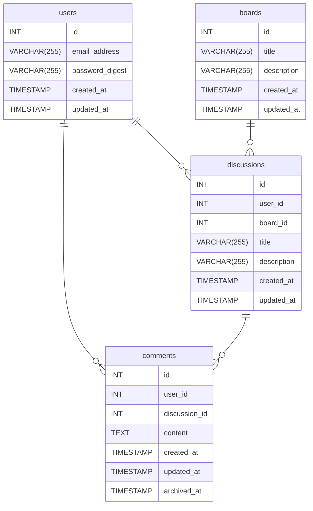

# データベース資料

## テーブル一覧

- users（ユーザーテーブル）
- boards（ボードテーブル）
- discussions（スレッドテーブル）
- comments（投稿テーブル）
- boards（掲示板テーブル）
- 【保留】attachments（添付ファイル管理テーブル）

## ER 図

## users（ユーザー管理テーブル）

| カラム名        | データ型     | 制約                                                  | 説明           |
| --------------- | ------------ | ----------------------------------------------------- | -------------- |
| id              | INT          | PRIMARY KEY, UNIQUE KEY                               | ユーザー ID    |
| email_address   | VARCHAR(255) | UNIQUE, NOT NULL                                      | メールアドレス |
| password_digest | VARCHAR(255) | NOT NULL                                              | パスワード     |
| created_at      | TIMESTAMP    | DEFAULT CURRENT_TIMESTAMP                             | 作成日時       |
| updated_at      | TIMESTAMP    | DEFAULT CURRENT_TIMESTAMP ON UPDATE CURRENT_TIMESTAMP | 更新日時       |

↑ にいろいろと書いたが、Rails が提供するユーザー管理に沿えれば、別にそれで構わない。

### generate コマンド

`bin/rails generate authentication`

### create コマンド

`User.create(email_address: "user@example.org", password: "secret", password_confirmation: "secret")`
`User.create(email_address: "user2@example.org", password: "secret", password_confirmation: "secret")`

## boards（掲示板テーブル）

| カラム名    | データ型     | 制約                                                  | 説明           |
| ----------- | ------------ | ----------------------------------------------------- | -------------- |
| id          | INT          | PRIMARY KEY, UNIQUE KEY                               | 掲示板 ID      |
| title       | VARCHAR(255) | NOT NULL                                              | 掲示板タイトル |
| description | VARCHAR(255) | NOT NULL                                              | 掲示板説明文   |
| created_at  | TIMESTAMP    | DEFAULT CURRENT_TIMESTAMP                             | 作成日時       |
| updated_at  | TIMESTAMP    | DEFAULT CURRENT_TIMESTAMP ON UPDATE CURRENT_TIMESTAMP | 更新日時       |

いったん board は 1 つのみとする。

### scaffold コマンド

`bin/rails generate scaffold Board title:string description:text`

<!-- ### generate コマンド -->
<!-- `bin/rails generate model Board title:string description:string` -->
<!-- ### create コマンド -->
<!-- `Board.create(title: "first boad title", description: "first board description")` -->

## discussions（スレッド管理テーブル）

| カラム名    | データ型     | 制約                                                  | 説明                      |
| ----------- | ------------ | ----------------------------------------------------- | ------------------------- |
| id          | INT          | PRIMARY KEY, UNIQUE KEY                               | スレッド ID               |
| user_id     | INT          | FOREIGN KEY (users)                                   | スレッド作成者ユーザー ID |
| board_id    | INT          | FOREIGN KEY (boards)                                  | スレッドが属する掲示板 ID |
| title       | VARCHAR(255) | NOT NULL                                              | スレッドタイトル          |
| description | VARCHAR(255) | NOT NULL                                              | スレッド説明文            |
| created_at  | TIMESTAMP    | DEFAULT CURRENT_TIMESTAMP                             | 作成日時                  |
| updated_at  | TIMESTAMP    | DEFAULT CURRENT_TIMESTAMP ON UPDATE CURRENT_TIMESTAMP | 更新日時                  |

### scaffold コマンド

`bin/rails generate scaffold Discussion title:string description:text user:references board:references`

<!-- ### generate コマンド -->
<!-- `bin/rails generate model Discussion user:references board:references title:string description:string` -->
<!-- ### create コマンド -->
<!-- `Discussion.create(user_id: 1, board_id: 1, title: "Thread title", description: "Thread description")` -->

## comments(スレッド内の投稿管理テーブル)

| カラム名      | データ型  | 制約                                                  | 説明                           |
| ------------- | --------- | ----------------------------------------------------- | ------------------------------ |
| id            | INT       | PRIMARY KEY, UNIQUE KEY                               | 投稿 ID                        |
| user_id       | INT       | FOREIGN KEY (users)                                   | 投稿者ユーザー ID              |
| discussion_id | INT       | FOREIGN KEY (discussions)                             | comment が紐づく discussion ID |
| content       | TEXT      | NOT NULL                                              | 投稿内容                       |
| created_at    | TIMESTAMP | DEFAULT CURRENT_TIMESTAMP                             | 作成日時                       |
| updated_at    | TIMESTAMP | DEFAULT CURRENT_TIMESTAMP ON UPDATE CURRENT_TIMESTAMP | 更新日時                       |
| archived_at   | TIMESTAMP | ON UPDATE CURRENT_TIMESTAMP                           | 削除日時                       |

archived_at に日付が入っているなら「このコメントは削除されました」の表記にする。

### scaffold コマンド

`bin/rails generate scaffold Comment content:text archived_at:datetime user:references discussion:references`

<!-- ### generate コマンド -->
<!-- `bin/rails generate model Comment user_id:integer content:string archived_at:timestamp` -->
<!-- ### create コマンド -->
<!-- `Comment.create(user_id: 1, discussion_id: 1, content: "comment content")` -->
<!-- `Comment.create(user_id: 1, discussion_id: 1, content: "テスト投稿です！")` -->

## 【保留】attachments（添付ファイル管理テーブル）

投稿にファイルを添付できるようにしようかと思ったが、いったん後で。  
単に comments テーブルにカラムを作成して、アップロードしたファイル名 + 乱数 + timestamp で、静的アセット領域へのパスを書いておくだけでも良いかも。

## 保留にしたテーブル・機能

- 掲示板を複数にする。
- ファイル添付可能にする。attachments（添付ファイル管理テーブル）の作成
  - 単にアップロードしたファイルに + 乱数 + timestamp でリネームして保存で良い気もするが。
- 検索機能
  - Rails より SQL がどうのこうのになりそうなので保留。やってみたくはあるが。
